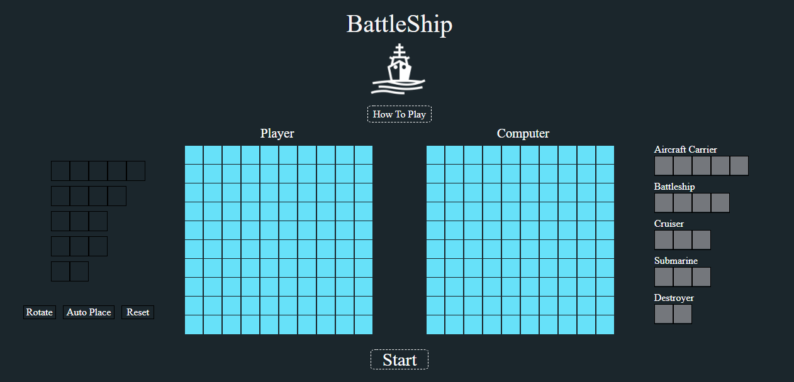
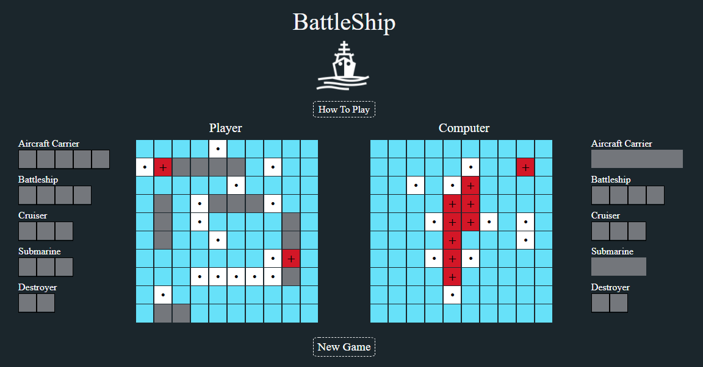

## Battleship
App to play Battleship against the computer.

🔗 **Live preview** of the app is [here](https://j-haze.github.io/BattleshipApp/).

### Purpose: ###
Create a Battleship game to play against the computer. The app shows off my ability to create an application using React and by utilizing Test Driven Development.

### Features: ###

* Turn based game
  * Set up your board, then trade turns attacking the other player's battleships.
* Freely place your ships anywhere on the board
* Play against the computer AI

### Built With: ###

* React 
* JavaScript
* HTML/CSS

### Picture: ###

